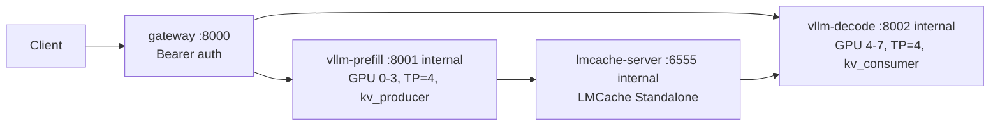

# 三方审计报告响应与优化方案

## 1. 正面回复

三方审计报告对当前方案的核心判断是有价值的：Prefill/Decode 分离 + LMCache KV Cache 共享的方向成立，但当前实现不能直接进入生产上线。这个结论与本项目的定位一致。当前仓库目标是完成 MVP 验证，而不是声明生产就绪。

我们正面采纳审计报告中以下事实判断：

- 4 卡 Prefill / 4 卡 Decode 比单节点 TP=8 更适合无 NVLink 的 8 卡 RTX 4090 环境。
- LMCache 不应对宿主机暴露无认证端口。
- vLLM 内部节点不应直接暴露到外部网络。
- vLLM API 需要认证，避免绕过 gateway 直接消耗推理资源。
- `latest` 镜像、缺健康检查、缺日志轮转和缺资源边界都不适合生产化。
- `gpu-memory-utilization=0.85` 和 `local_cpu_percentage=0.4` 对 24GB 4090 与宿主机内存都有偏高风险。

本次优化已经把审计报告中可以安全落地的 P0/P1 项先合入 MVP 资产，并把仍需目标机验证的项保留为后续优化路线。

## 2. 采纳并已实施的优化

| 审计问题 | 响应 | 当前处理 |
| --- | --- | --- |
| LMCache 端口对外暴露 | 采纳 | 按官方 Docker 示例采用 `network_mode: host`，但 LMCache MP 与 HTTP 管理面只绑定 loopback，不作为外部入口 |
| vLLM 8001/8002 对外暴露 | 采纳 | vLLM Prefill/Decode 使用 host 网络并显式 `--host 127.0.0.1`，外部只访问 gateway 的 `8000` |
| vLLM API 无认证 | 采纳 | Prefill/Decode 增加 `--api-key ${VLLM_API_KEY:-sk-mvp-change-me}` |
| Gateway 到 vLLM 无认证传递 | 采纳 | gateway 新增 `UPSTREAM_API_KEY`，向内部 vLLM 注入 Bearer token |
| Gateway 外部入口无认证 | 采纳 | gateway 新增 `GATEWAY_API_KEY`，保护 `/v1/chat/completions` |
| 缺健康检查 | 采纳 | 四个服务均增加 `healthcheck` |
| 缺日志轮转 | 采纳 | 增加 `json-file` 日志轮转，`max-size: "50m"`、`max-file: "5"` |
| 显存利用率偏高 | 采纳 | 默认 `GPU_MEMORY_UTILIZATION` 从 `0.85` 降至 `0.80` |
| LMCache 配置不匹配 | 采纳 | `lmcache_config.yaml` 去除 `backend: "gpu"`，改为 `local_cpu: true` + `max_local_cpu_size: 5` |
| 缺 prefix caching | 采纳 | Prefill/Decode 增加 `--enable-prefix-caching` |
| 缺批处理边界 | 采纳 | 增加 `--max-num-seqs` 与 `--max-num-batched-tokens` 参数 |
| Decode 调度参数缺失 | 采纳 | Decode 增加 `--scheduler-delay-factor` |
| `.env` 管理不足 | 采纳 | 扩展 `compose/.env.example`，集中模型、认证、资源和调优参数 |

## 3. 部分采纳但需要目标机验证的项

| 审计问题 | 响应 | 原因 |
| --- | --- | --- |
| 固定镜像版本 | 已采纳到 MVP 默认值 | `.env.example` 与 Compose 默认值已固定到 `vllm/vllm-openai:latest` 和 `lmcache/standalone:latest`，避免 nightly 漂移。生产化仍应在目标 GPU 服务器验证后固定到镜像 digest。 |
| 健康检查依赖 `/health` | 部分采纳 | vLLM OpenAI server 通常提供 `/health`，但不同镜像版本可能有差异。目标机需用 `docker compose ps` 和日志确认。 |
| LMCache Standalone 健康检查 | 部分采纳 | 当前通过 HTTP `/healthcheck` 检查 standalone 服务就绪，并保留指标接入作为后续生产化优化。 |
| 资源 limits | 部分采纳 | Compose 中硬设 CPU/memory limit 可能误伤 8 卡推理启动。建议先完成 MVP 压测，再根据实测显存、CPU 内存和 KV Cache 占用设置硬限制。 |
| TLS / Nginx / Traefik | 部分采纳 | 单机 MVP 可先只暴露 gateway；生产环境再由反向代理统一做 TLS、限流和审计。 |

## 4. 不直接采纳的项

### 4.1 不直接采纳 `--enable-prefill-decode-mode` 和 `--role prefill/decode`

审计报告指出缺少 `--enable-prefill-decode-mode` 与 `--role prefill/decode`。这个问题背后的判断是正确的：当前配置必须显式声明 Prefill/Decode 的 KV 生产者和消费者角色。

但本项目不直接采用报告里的参数写法。原因是 vLLM 官方 disaggregated prefilling 和 LMCache integration 方案使用的是 `--kv-transfer-config`，通过 `kv_connector`、`kv_role` 和 connector extra config 声明 KV 传输角色。

当前实现采用：

```text
--kv-transfer-config '{"kv_connector":"LMCacheMPConnector","kv_connector_module_path":"lmcache.integration.vllm.lmcache_mp_connector","kv_role":"kv_producer",...}'
```

Decode 节点对应使用：

```text
--kv-transfer-config '{"kv_connector":"LMCacheMPConnector","kv_connector_module_path":"lmcache.integration.vllm.lmcache_mp_connector","kv_role":"kv_consumer",...}'
```

这保留了审计报告要求的“角色明确”目标，但避免引入未确认的 vLLM CLI 参数。

### 4.2 不把 5 卡 Prefill / 3 卡 Decode 作为默认配置

审计报告支持弹性切分方向，这一点成立。但当前默认仍保持 4/4，原因是 TP 数量必须与模型分片约束兼容。5/3 需要在目标模型上验证 `tensor-parallel-size=5` 和 `tensor-parallel-size=3` 是否可加载，不能作为默认生产配置。

## 5. 已优化后的架构



优化后的外部暴露面：

| 服务 | 宿主机暴露 | 容器网络暴露 |
| --- | --- | --- |
| `gateway` | `8000` | `8000` |
| `vllm-prefill` | loopback | `8001` |
| `vllm-decode` | loopback | `8002` |
| `lmcache-server` | loopback | `6555`, `8080` |

## 6. 优化路线

### Phase 1：MVP 加固后验证

目标：证明当前设计能跑通，并且安全暴露面、认证和基础观测符合 MVP 要求。

执行项：

- 在目标 8 卡 4090 服务器上执行 `docker compose config`。
- 执行 `docker compose up -d --build`。
- 确认四个服务健康检查通过。
- 使用 `GATEWAY_API_KEY` 调用 gateway。
- 运行 `backend/tests/test_verification.py`，对比 cold 和 repeated 长前缀 TTFT。
- 采集 `x-prefill-status`、`x-prefill-ms`、gateway 日志、vLLM 日志和 LMCache 日志。

通过标准：

- 外部只能访问 gateway `8000`。
- 无认证请求被 gateway 拒绝。
- Prefill/Decode 内部节点不能从宿主机直接访问。
- 重复长前缀请求的 TTFT 明显低于冷请求。
- Prefill 高负载期间 Decode 流式输出没有明显长停顿。

### Phase 2：生产化前优化

目标：从 MVP 走向可上线的生产基线。

执行项：

- 将 `VLLM_IMAGE`、`LMCACHE_IMAGE` 从当前 MVP 固定 tag 进一步固定到目标机实测通过的 digest。
- 引入 Nginx/Traefik 做 TLS、限流、请求大小限制和统一审计日志。
- 接入 Prometheus/Grafana，采集 TTFT、TPOT、tokens/s、LMCache 命中率、GPU 显存、CPU 内存和 HTTP 5xx。
- 根据压测结果设置 CPU、memory、并发和 batch 上限。
- 对 LMCache 单点做主备或多节点方案评估。
- 增加 32K 长上下文 + 并发短请求混合压测。

### Phase 3：弹性扩展

目标：验证更多业务流量形态。

执行项：

- 在模型兼容前提下测试 5 卡 Prefill / 3 卡 Decode。
- 测试多个 Decode 副本承接高并发短输出。
- 测试多个 Prefill 副本承接 RAG 长输入。
- 评估迁移到 Kubernetes 或 vLLM production-stack 的 router 架构。

## 7. 当前结论

审计报告的核心风险判断成立：原始实现不适合直接生产上线。

经过本次优化后，当前实现更适合作为“安全收敛后的 MVP 验证基线”：它保留了 PD 分离和 KV Cache 验证目标，同时收敛了外部暴露面、补齐了认证、健康检查、日志轮转和基础 vLLM 调优参数。

剩余关键风险是运行时风险，而不是文档或静态配置风险：镜像版本兼容性、目标模型 TP 约束、LMCache 实际命中率、健康检查端点可用性和 8 卡 4090 上的真实显存余量都必须在目标 GPU 服务器上验证。

参考依据：

- [vLLM Disaggregated Prefilling](https://docs.vllm.ai/en/stable/features/disagg_prefill.html)
- [LMCache Integration](https://docs.lmcache.ai/developer_guide/integration.html)
- [LMCache Multiprocessing Configuration](https://docs.lmcache.ai/mp/configuration.html)
