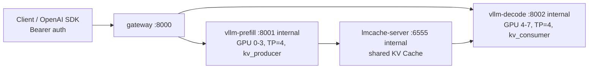

# DeepSeek vLLM 多节点 PD 分离 MVP 定稿设计方案

## 1. MVP 结论

本方案可以进入 MVP 验证阶段。

MVP 的验证目标不是证明 8 张 RTX 4090 可以稳定承载 DeepSeek-V3/R1 全量生产负载，而是验证以下架构假设：

- vLLM 可以在同一台 8 卡 4090 服务器上拆成多个推理节点运行。
- Prefill 节点和 Decode 节点各自使用 TP=4，替代单节点 TP=8。
- LMCache 可以作为共享 KV Cache 层，让 Decode 节点复用 Prefill 阶段产生的长前缀缓存。
- 统一 gateway 可以提供 OpenAI 兼容入口，并把一次用户请求拆成 Prefill 和 Decode 两段。
- 重复长前缀请求的 TTFT 应显著低于冷请求。
- 长上下文 Prefill 压力应主要落在 Prefill 节点，Decode 节点保持更稳定的流式输出能力。

当前 MVP 基线采用 4 卡 Prefill / 4 卡 Decode。5 卡 Prefill / 3 卡 Decode 可以作为后续容量规划方向，但必须先确认目标模型在 vLLM 中支持对应 TP 大小。很多模型要求 `tensor-parallel-size` 能整除注意力头数或分片维度，不能把 5/3 当成任意可用的默认配置。

## 2. 官方依据和边界

本方案参考 vLLM 官方 disaggregated prefilling 文档、LMCache integration 文档和 vLLM production-stack 的 disaggregated-prefill 示例。

需要明确三点边界：

- vLLM 官方将 disaggregated prefilling 标注为 experimental，并明确其核心价值是分别调优 TTFT 和 ITL、控制 tail ITL，而不是直接提升总体吞吐。
- LMCache 的作用是让 vLLM 对可复用输入内容查找并注入 KV chunks，从而减少重复 Prefill 计算；是否命中取决于请求内容、版本兼容和配置。
- vLLM production-stack 的生产示例采用 Prefill engine、Decode engine 和 Router 三类组件；本仓库的 gateway 是 MVP 级 Docker Compose 实现，用于先在单机上验证链路和指标。

参考链接：

- [vLLM Disaggregated Prefilling](https://docs.vllm.ai/en/stable/features/disagg_prefill.html)
- [LMCache Integration](https://docs.lmcache.ai/developer_guide/integration.html)
- [LMCache MP Deployment Guide](https://docs.lmcache.ai/mp/deployment.html)
- [Docker Compose GPU Support](https://docs.docker.com/compose/how-tos/gpu-support/)
- [vLLM production-stack Disaggregated Prefill](https://github.com/vllm-project/production-stack/blob/main/docs/source/use_cases/disaggregated-prefill.rst)

## 3. 设计目标

### 3.1 降低 TP 通信开销

原始单节点方案为 8 张卡共同运行一个 vLLM 实例，`--tensor-parallel-size 8`。在 RTX 4090 无 NVLink 的环境下，NCCL collective 通信需要经过 PCIe，8 卡通信组会放大 PCIe 拥塞、同步等待和尾延迟。

MVP 定稿方案将一个 TP=8 通信组拆成两个 TP=4 通信组：

- `vllm-prefill`: 宿主机 GPU 0,1,2,3，容器内 `CUDA_VISIBLE_DEVICES=0,1,2,3`，`--tensor-parallel-size 4`。
- `vllm-decode`: 宿主机 GPU 4,5,6,7，容器内重新枚举为 `CUDA_VISIBLE_DEVICES=0,1,2,3`，`--tensor-parallel-size 4`。

预期收益是通信参与 GPU 数量减少、单个 collective 组更小、PCIe 争用更低。是否达到目标，以 NCCL 错误率、Prefill 耗时、Decode TTFT 和 GPU 利用率数据为准。

### 3.2 提升稳定性并隔离雪崩

混合部署时，32K 长上下文请求会占用大量 Prefill 计算资源，容易让同一 vLLM 实例中的其他流式输出出现卡顿。

PD 分离后：

- Prefill 节点负责输入上下文计算和 KV Cache 生产。
- Decode 节点负责流式生成。
- 长输入请求主要压 Prefill 节点。
- Decode 节点不再和长上下文 Prefill 争同一组 GPU。

MVP 需要验证的不是“绝对不卡顿”，而是在相同并发压力下，Decode 节点的 TTFT、tokens/s 和流式 chunk 间隔比混合 TP=8 方案更稳定。

### 3.3 保留扩容弹性

当前实施基线固定为 4/4 切分，因为它最容易在 8 张 4090 上落地，也最符合常见模型 TP 分片约束。

后续扩容方式有三类：

- 调整 Prefill 和 Decode 的 GPU 切分，例如 5 卡 Prefill / 3 卡 Decode，但前提是模型和 vLLM 支持 TP=5 与 TP=3。
- 增加 Decode 副本，用多个 Decode 服务承接更多在线流式输出。
- 增加 Prefill 副本，用多个 Prefill 服务承接 RAG 长上下文输入。

生产阶段更推荐“多副本 + 负载均衡”的扩容方式，而不是只依赖任意 TP 数量切分。

## 4. 最终 MVP 拓扑



组件职责如下：

| 组件 | 端口 | GPU | 职责 |
| --- | --- | --- | --- |
| `lmcache-server` | 内部 `6555`, `8080` | 无 | LMCache Standalone 共享 KV Cache 层 |
| `vllm-prefill` | 内部 `8001` | `0,1,2,3` | 长上下文 Prefill，生产 KV Cache |
| `vllm-decode` | 内部 `8002` | `4,5,6,7` | Decode 和流式输出 |
| `gateway` | 宿主机 `8000` | 无 | OpenAI 兼容入口，编排 Prefill -> Decode |

## 5. 请求链路

1. 客户端带 `Authorization: Bearer ${GATEWAY_API_KEY}` 请求 `POST /v1/chat/completions` 到 `gateway:8000`。
2. Gateway 复制原始请求，改写为 `max_tokens=1`、`stream=false`，发送给 `127.0.0.1:8001`。
3. Prefill 节点完成长上下文计算，LMCache 根据配置捕获并共享 KV Cache。
4. Gateway 将原始请求发送给 `127.0.0.1:8002`。
5. Decode 节点通过 LMCache 复用相同长前缀 KV Cache，并把结果返回给客户端。
6. Gateway 在响应头中返回 Prefill 观测信息：

| 响应头 | 含义 |
| --- | --- |
| `x-request-id` | 请求追踪 ID |
| `x-prefill-status` | Prefill 阶段是否成功 |
| `x-prefill-ms` | Prefill 阶段耗时 |
| `x-prefill-error` | Prefill 失败时的错误摘要 |

## 6. 已实现的 MVP 资产

### 6.1 Docker Compose

Compose 已按能力拆分，避免一个大文件同时承载缓存、推理和网关职责。当前文件职责如下：

| 文件 | 职责 |
| --- | --- |
| `compose/docker-compose.yml` | Compose 项目名定义，不放具体服务 |
| `compose/docker-compose.lmcache.yml` | `lmcache-server` KV Cache 服务 |
| `compose/docker-compose.prefill.yml` | `vllm-prefill` Prefill 生产者节点 |
| `compose/docker-compose.decode.yml` | `vllm-decode` Decode 消费者节点 |
| `compose/docker-compose.gateway.yml` | `gateway` 统一 OpenAI 兼容入口 |

推荐通过 `ops/pd-stack.sh` 或 `ops/pd-stack.ps1` 组合这些文件，不建议运维人员手写多段 `docker compose -f ...` 命令。

当前 Compose 采用 LMCache 官方 Docker 示例的 host 网络等价写法：LMCache、Prefill、Decode 和 Gateway 均使用 `network_mode: host`。vLLM Prefill/Decode 显式绑定 `127.0.0.1`，LMCache HTTP 管理面显式绑定 `127.0.0.1`，避免内部服务通过宿主机公网地址暴露；Gateway 仍作为唯一外部业务入口监听 `8000`。

关键参数：

```yaml
vllm-prefill:
  network_mode: host
  environment:
    - CUDA_VISIBLE_DEVICES=0,1,2,3
    - NCCL_P2P_DISABLE=1
    - NCCL_IB_DISABLE=1
    - NCCL_SHM_DISABLE=0
    - NCCL_DEBUG=WARN
  command: >
    /model
    --tensor-parallel-size 4
    --disable-custom-all-reduce
    --enable-prefix-caching
    --enable-chunked-prefill
    --api-key ${VLLM_API_KEY:-sk-mvp-change-me}
    --kv-transfer-config '{"kv_connector":"LMCacheMPConnector","kv_role":"kv_producer","kv_connector_extra_config":{"lmcache.mp.port":6555}}'
    --host 127.0.0.1
    --port 8001

vllm-decode:
  network_mode: host
  environment:
    - CUDA_VISIBLE_DEVICES=0,1,2,3
    - NCCL_P2P_DISABLE=1
    - NCCL_IB_DISABLE=1
    - NCCL_SHM_DISABLE=0
    - NCCL_DEBUG=WARN
  command: >
    /model
    --tensor-parallel-size 4
    --disable-custom-all-reduce
    --enable-prefix-caching
    --api-key ${VLLM_API_KEY:-sk-mvp-change-me}
    --kv-transfer-config '{"kv_connector":"LMCacheMPConnector","kv_role":"kv_consumer","kv_connector_extra_config":{"lmcache.mp.port":6555}}'
    --host 127.0.0.1
    --port 8002
```

`MODEL_PATH`、`MODEL_QUANTIZATION`、`MAX_MODEL_LEN`、`GPU_MEMORY_UTILIZATION` 等参数通过 `compose/.env.example` 暴露。

注意：`deploy.resources.reservations.devices.device_ids` 负责绑定宿主机物理 GPU；容器内 CUDA 会重新枚举可见设备，因此 Prefill 和 Decode 容器内部都使用 `CUDA_VISIBLE_DEVICES=0,1,2,3`。这可以避免 Decode 容器在仅可见 4 张卡时继续查找内部编号 `4,5,6,7` 而启动失败。

### 6.2 LMCache 配置

配置文件为 `compose/lmcache_config.yaml`：

```yaml
chunk_size: 256
local_cpu: true
max_local_cpu_size: 5
```

该配置用于验证长前缀 KV Cache 复用。`max_local_cpu_size: 5` 是 MVP 默认值，目标机压测时必须观察 CPU 内存、换页和 LMCache 命中率。

### 6.3 Gateway

Gateway 代码位于 `backend/gateway.py`，镜像资产为：

- `backend/Dockerfile`
- `backend/requirements.txt`

容器内默认路由：

```text
PREFILL_NODE_URL=http://127.0.0.1:8001/v1/chat/completions
DECODE_NODE_URL=http://127.0.0.1:8002/v1/chat/completions
UPSTREAM_API_KEY=${VLLM_API_KEY:-sk-mvp-change-me}
GATEWAY_API_KEY=${GATEWAY_API_KEY:-sk-mvp-change-me}
```

Gateway 支持：

- `GET /healthz`
- `POST /v1/chat/completions`
- 流式请求透传
- 非流式 JSON 响应透传
- Gateway Bearer 认证
- 内部 vLLM Bearer 认证转发
- Prefill 失败时降级到 Decode
- 响应头输出 Prefill 耗时和状态

### 6.4 MVP 验证脚本

验证脚本位于 `backend/tests/test_verification.py`。它会使用同一个长系统 Prompt 连续发起三次请求：

- `cold-long-prefix`
- `repeat-long-prefix-1`
- `repeat-long-prefix-2`

验证重点：

- 首次冷请求 TTFT。
- 重复长前缀请求 TTFT。
- `x-prefill-status` 和 `x-prefill-ms` 响应头。
- Gateway 日志中的 Prefill -> Decode 路径。

## 7. 部署步骤

在目标 8 卡 4090 服务器上执行：

```bash
cd compose
cp .env.example .env
```

编辑 `.env`：

```bash
MODEL_PATH=/data/temp/yhb/DeepSeek-V4-Flash
MODEL_QUANTIZATION=awq
MAX_MODEL_LEN=32768
GPU_MEMORY_UTILIZATION=0.80
```

MVP 加固版默认值为 `GPU_MEMORY_UTILIZATION=0.80`。如果目标模型加载失败或显存余量充足，再根据压测结果调整。

启动：

```bash
bash ../ops/pd-stack.sh up
```

检查服务：

```bash
bash ../ops/pd-stack.sh ps
bash ../ops/pd-stack.sh logs cache
bash ../ops/pd-stack.sh logs prefill
bash ../ops/pd-stack.sh logs decode
bash ../ops/pd-stack.sh logs gateway
```

检查 Gateway：

```bash
bash ../ops/pd-stack.sh health
```

调用推理接口时需要带 gateway API key：

```bash
curl http://localhost:8000/v1/chat/completions \
  -H "Authorization: Bearer ${GATEWAY_API_KEY}" \
  -H "Content-Type: application/json" \
  -d '{"model":"/model","messages":[{"role":"user","content":"hello"}],"max_tokens":16}'
```

运行 MVP 验证：

```bash
cd ..
bash ops/pd-stack.sh verify
```

如果在服务器上从仓库根目录执行验证脚本，保持默认 `API_URL=http://localhost:8000/v1/chat/completions` 即可。

常用运维命令：

```bash
bash ops/pd-stack.sh config
bash ops/pd-stack.sh up
bash ops/pd-stack.sh restart decode
bash ops/pd-stack.sh logs gateway
bash ops/pd-stack.sh down
```

PowerShell 环境可使用：

```powershell
.\ops\pd-stack.ps1 config
.\ops\pd-stack.ps1 up
.\ops\pd-stack.ps1 restart decode
.\ops\pd-stack.ps1 logs gateway
.\ops\pd-stack.ps1 down
```

## 8. 验证指标

### 8.1 必须通过

| 指标 | 通过标准 |
| --- | --- |
| Compose 配置 | `docker compose config` 通过 |
| GPU 绑定 | Prefill 物理绑定 GPU 0-3，Decode 物理绑定 GPU 4-7；两个容器内均使用 CUDA 编号 0-3 |
| vLLM 启动 | 两个节点均完成模型加载，没有 OOM |
| NCCL 稳定性 | 无 NCCL P2P 或 IB 相关卡死 |
| Gateway 健康检查 | `GET /healthz` 返回 `status=ok` |
| Gateway 认证 | 无 Bearer token 的推理请求返回 401 |
| 端口暴露面 | Gateway 监听 `8000`；Prefill `8001`、Decode `8002`、LMCache `6555` 绑定 loopback，不作为外部业务入口 |
| OpenAI 兼容 | `POST /v1/chat/completions` 能返回流式结果 |
| Prefill 观测 | 响应头包含 `x-prefill-status` 和 `x-prefill-ms` |
| Cache 复用 | 重复长前缀请求 TTFT 低于冷请求 |

### 8.2 建议采集

| 指标 | 工具 |
| --- | --- |
| TTFT | `backend/tests/test_verification.py` |
| tokens/s | vLLM 日志或外部压测脚本 |
| chunk 间隔 | Gateway 或客户端流式日志 |
| GPU 显存 | `nvidia-smi dmon` |
| GPU 利用率 | `nvidia-smi dmon` |
| CPU 内存 | `free -h` / `vmstat` |
| 磁盘 IO | `iostat` |
| LMCache 命中 | LMCache 日志或指标 |

## 9. 对三个目标的验收方式

### 9.1 TP 通信开销降低

验收方法：

1. 跑单节点 TP=8 对照组。
2. 跑当前 PD 分离 TP=4 + TP=4 实验组。
3. 对比同一长上下文输入下的 Prefill 时间、NCCL 错误、GPU 利用率和端到端 TTFT。

通过标准：

- 实验组不再出现 TP=8 下的 NCCL 卡死或长时间同步等待。
- Prefill 与 Decode 的 GPU 利用率边界清晰。
- 在同等请求形态下，端到端延迟和尾延迟低于 TP=8 对照组。

### 9.2 稳定性隔离

验收方法：

1. 对 Prefill 注入 32K 长上下文请求。
2. 同时对 Decode 侧维持短回复流式请求。
3. 观察 Decode chunk 间隔和 tokens/s。

通过标准：

- 长上下文输入期间，Decode 流式输出没有明显长时间停顿。
- Decode 侧 tokens/s 波动显著小于 TP=8 混合部署。
- Prefill 高负载不会导致 Decode 服务不可用。

### 9.3 弹性扩容

验收方法：

1. 先以 4/4 作为可运行基线。
2. 根据业务输入和输出比例决定扩容方向。
3. 在确认模型 TP 约束后再测试 5 卡 Prefill / 3 卡 Decode 或其他切分。

通过标准：

- 配置修改后，vLLM 能成功加载模型。
- GPU 绑定和服务职责仍然清晰。
- Gateway 只需要改目标服务地址或负载均衡配置，不需要改客户端协议。

## 10. 已知限制

- 当前方案验证的是单机多 vLLM 节点，不是跨物理机分布式集群。
- Gateway 的 Prefill 编排是 MVP 实现，不等同于 vLLM 原生生产级 PD disaggregation 调度器。
- LMCache 是否命中取决于版本兼容、请求前缀一致性、缓存配置和 vLLM 集成行为。
- 当前 `.env.example` 默认使用 `lmcache/vllm-openai:v0.4.5-cu129` 和 `lmcache/standalone:v0.4.5-cu129`，用于避免 nightly 漂移；生产化仍应在目标机验证后固定到 digest。
- DeepSeek-V3/R1 全量模型通常不适合直接以 8 张 24GB 4090 承载，MVP 应优先使用可在 TP=4 下加载的量化版或蒸馏版。
- LMCache 本地 CPU 缓存大小需要基于宿主机内存和命中率压测调整。

## 11. 生产化前必须补齐

- 固定 vLLM、LMCache、CUDA、Python 依赖和模型版本。
- 服务健康检查、启动顺序等待和基础认证已进入 MVP 配置；生产前仍需目标机验证并接入告警。
- 增加限流、请求体大小限制和审计日志。
- 增加 Prometheus 指标：TTFT、tokens/s、Prefill 耗时、Decode 耗时、LMCache 命中率。
- 增加自动化压测脚本，覆盖冷请求、热前缀请求、32K 长上下文、并发短请求和混合流量。
- 明确 Prefill 失败时的降级策略：直接 Decode、返回错误、或按业务优先级排队。
- 使用更稳健的负载均衡策略支持多个 Prefill 和 Decode 副本。

## 12. 最终判断

当前 MVP 方案在工程上可实施，能够围绕 vLLM 分布式多节点并行推理、KV Cache 复用和 PD 分离完成验证。

建议按 4/4 切分先跑通链路，再用 TP=8 单节点方案做对照压测。只有在 TTFT、Decode 稳定性、NCCL 稳定性和缓存命中数据均达标后，再讨论 5/3 或多副本扩容。
